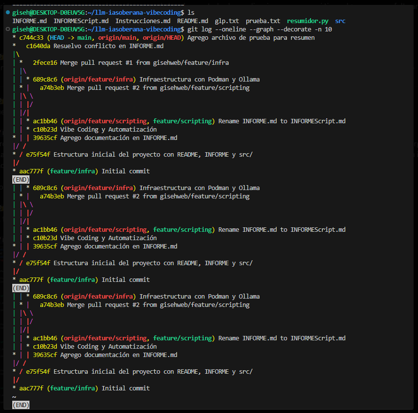

# INFORME

## Arquitectura
Entorno: GNU/Linux con Podman (alternativa libre, daemonless y rootless a Docker).

Comandos utilizados:

bash
podman run -d -v ollama:/root/.ollama -p 11434:11434 --name ollama docker.io/ollama/ollama
podman ps
curl http://localhost:11434
podman exec -it ollama ollama run smollm
Modelo elegido: smollm (ultraligero, optimizado para CPU y poca RAM).

Infraestructura validada: El contenedor Ollama quedó corriendo en el puerto 11434, accesible desde localhost

## Bitácora de Vibe Coding
Como main realice el cambio de rama a infraestructura:

bash
git checkout feature/infra
podman start ollama
curl http://localhost:11434
podman exec -it ollama ollama run smollm
 Validación de que el contenedor Ollama estaba corriendo y el modelo smollm funcionaba.

Luego cambie de main a la rama scripting:

bash
git checkout feature/scripting
git pull origin feature/scripting
 Descarga de resumidor.py y archivos asociados.

Prueba del script:

bash
echo "Este es un texto de prueba para verificar el resumen automático." > prueba.txt
python3 resumidor.py prueba.txt --host localhost --model smollm
 Resultado: el script se conectó a Ollama y generó un resumen de 3 líneas.

En la siguiente imagen se puede observar parte del proceso:

## Reflexión Soberana
Procesar información localmente con Ollama en Podman mostró ventajas claras:

Ventajas: Control total de la infraestructura, soberanía sobre los datos, independencia de servicios privativos, y posibilidad de auditar cada paso.

Desventajas: Limitaciones de hardware (CPU/RAM), necesidad de configurar manualmente el entorno y resolver errores de conexión o rutas.
